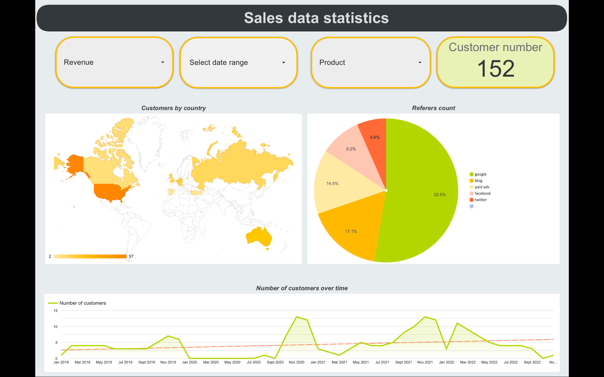

# Online Bookstore Sales Dashboard

## 📊 Overview

Interactive Looker Studio dashboard for real-time monitoring and analysis of online bookstore sales performance, customer behavior, and acquisition metrics.

## 🎯 Key Metrics & Visualizations

### 📈 Sales Metrics
- **Total Revenue** — Real-time revenue tracking
- **Customer Count** — Total number of customers (152)
- **Date Range Filtering** — Analyze data for specific periods

### 📍 Geographic Analysis
- **Customers by Country** — Geo-map showing customer distribution across regions
- Color-coded intensity map for easy identification of key markets

### 📊 Customer Acquisition Sources
- **Referrers Count (Pie Chart):**
  - Google: 52.6% (primary traffic source)
  - Blog: 17.1%
  - Paid Ads: 14.5%
  - Facebook: 9.2%
  - Twitter: 6.6%

### 📉 Customer Trends
- **Number of Customers Over Time** — Line chart tracking customer growth from Jan 2019 to present
- Shows seasonal patterns and growth trends

### 🔍 Interactive Filters
- **Revenue Filter** — Compare by revenue ranges
- **Date Range Selector** — Analyze specific time periods
- **Product Filter** — Segment by specific books/categories

## 📸 Dashboard Preview

## 🔗 Live Dashboard

[View Live Dashboard](https://datastudio.google.com/reporting/a7b8adae-aa95-4a41-9b7b-a34b8af7abd7)

## 💡 Key Insights

- Google is the dominant referral source (52.6% of traffic)
- Customer acquisition shows seasonal peaks (particularly around Jul 2020, Jan 2021)
- Geographic distribution spans multiple countries with focus on North America, Europe, Australia
- Consistent growth trend with some fluctuations over the 3-year period

## 🛠 Tools & Technologies

- **Looker Studio** — Interactive dashboard and visualization
- **Google Sheets** — Data source and backend
- **Data Visualization** — Maps, charts, time-series analysis

## 📚 Data Features

- Real-time data refresh
- Multi-dimensional filtering
- Geographic segmentation
- Time-series analysis
- Customer acquisition tracking
- Referral source attribution

## 🎓 Skills Demonstrated

✅ Dashboard design and UX
✅ Data visualization best practices
✅ Geospatial analysis
✅ Time-series analysis
✅ Interactive filtering and drill-down
✅ Customer acquisition analytics
✅ Report building in Looker Studio

## 👤 Author

Anastasiia Orlova

---

*Interactive dashboard for bookstore sales analysis and business intelligence*
